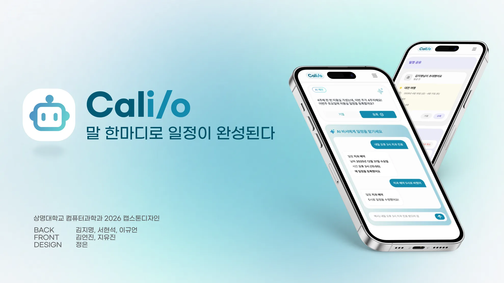

<div align="center">
  
  <p>
    말 한마디로 일정이 완성되는 AI 일정 관리 서비스<br />
    <strong>2026 Capstone Frontend</strong>
  </p>
  
  <br />
  <br />
  <p>
    
    
    
    
    
  </p>
</div>

---

## 📌 Overview

Calio는 사용자가 자연어로 말한 약속, 할 일, 공유 일정을 캘린더에 빠르게 정리할 수 있도록 돕는 AI 기반 일정 관리 서비스입니다. 반복적인 입력 과정을 줄이고, 개인 일정과 친구 간 일정 공유를 한 화면에서 관리하는 것을 목표로 합니다.

Calio Frontend는 Vite + React 기반의 캡스톤 프로젝트입니다. 캘린더, 투두, 친구, 인증 등 사용자 인터랙션이 많은 화면을 중심으로 빠른 데이터 패칭, UI 상태 관리, 폼 검증, 일관된 스타일 시스템을 구성합니다.

### 핵심 기능 영역

- 일정과 할 일을 한 흐름에서 관리하는 캘린더 중심 UI
- AI 제안을 통해 자연어 일정을 빠르게 등록하는 사용자 흐름
- 친구 초대와 일정 공유를 지원하는 협업 일정 관리
- React Query 기반 서버 상태 관리와 Axios API 레이어
- Zustand 기반 클라이언트 UI 상태 관리
- Emotion 기반 컴포넌트 스타일링과 공통 테마
- ESLint, Prettier, Husky, lint-staged를 통한 협업 품질 관리

## 🧭 Table of Contents

- [Tech Stack](#-tech-stack)
- [Getting Started](#-getting-started)
- [Scripts](#-scripts)
- [Environment Variables](#-environment-variables)
- [Project Structure](#-project-structure)
- [Conventions](#-conventions)
- [Contributors](#-contributors)

## 🛠 Tech Stack

| Category          | Stack                                            |
| ----------------- | ------------------------------------------------ |
| Core              | React 19, TypeScript, Vite                       |
| Routing           | React Router DOM                                 |
| Server State      | TanStack React Query, Query Key Factory          |
| Client State      | Zustand                                          |
| HTTP              | Axios                                            |
| Styling           | Emotion, theme/color palette                     |
| Form / Validation | React Hook Form, Yup                             |
| Calendar / Date   | React Big Calendar, React Day Picker, Moment     |
| Map               | React Kakao Maps SDK                             |
| Icon              | Lucide React, SVGR                               |
| Test              | Vitest, Testing Library, jsdom                   |
| Quality           | ESLint, Prettier, Husky, lint-staged, Commitlint |

## 🚀 Getting Started

### Prerequisites

- Node.js 20 LTS
- npm 또는 pnpm

```bash
node -v
# v20.x.x
```

### Installation

```bash
npm install
```

### Run Dev Server

```bash
npm run dev
```

### Build

```bash
npm run build
```

## 📜 Scripts

| Command           | Description                                         |
| ----------------- | --------------------------------------------------- |
| `npm run dev`     | Vite 개발 서버를 실행합니다.                        |
| `npm run build`   | TypeScript 빌드 후 Vite 프로덕션 빌드를 생성합니다. |
| `npm run lint`    | ESLint로 전체 코드를 검사합니다.                    |
| `npm run preview` | 빌드 결과를 로컬에서 미리 확인합니다.               |
| `npm run prepare` | Husky Git hook을 설치합니다.                        |

## 🔐 Environment Variables

루트 경로에 `.env` 파일을 생성하고 팀에서 공유한 값으로 채웁니다.

```bash
VITE_DEV_MODE=true
VITE_SERVER_URL=https://example.com
VITE_SITE_URL=https://calio.co.kr
```

| Key               | Description                                                                                         |
| ----------------- | --------------------------------------------------------------------------------------------------- |
| `VITE_DEV_MODE`   | React Query DevTools 표시 여부를 제어합니다. 로컬에서는 `true`, 배포에서는 `false`를 권장합니다.    |
| `VITE_SERVER_URL` | API 서버 URL입니다.                                                                                 |
| `VITE_SITE_URL`   | 배포 도메인입니다. `canonical`, `og:url`, `sitemap.xml`에 사용되며 배포 워크플로 시크릿과 맞춥니다. |

## 🗂 Project Structure

```text
src
├── app              # 앱 엔트리와 전역 설정
├── assets           # 로고, 아이콘, 로그인/랜딩 이미지
├── features         # 도메인별 기능 모듈
│   ├── Auth
│   ├── Calendar
│   ├── Common
│   ├── Friends
│   ├── Home
│   └── Todo
├── pages            # 라우트 단위 페이지
├── routes           # 라우팅 관련 설정
├── shared           # 공통 API, UI, hooks, styles, utils
├── store            # 전역 클라이언트 상태
└── types            # 공통 타입
```

### Import Alias

`@/`는 `src/`를 가리킵니다.

```ts
import { theme } from '@/shared/styles/theme'
```

## 🤝 Conventions

### Branch

```text
feature/#1-description
style/#1-description
fix/#1-description
docs/#1-description
```

### Commit

일반적인 prefix를 사용해 변경 의도를 먼저 드러냅니다.

```text
feat: add todo creation flow
fix: prevent calendar event overflow
style: align event detail card text
docs: update README
```

### Pull Request

- PR 제목은 `[Feature/#1] 작업 내용` 형식을 권장합니다.
- GitHub Issue를 먼저 등록하고 PR 본문에 `closes #이슈번호`를 포함합니다.
- 리뷰 기준은 `.github/instructions/capstone.instructions.md`를 따릅니다.

### Code Quality

- 저장 전 ESLint와 Prettier 규칙을 맞춥니다.
- `simple-import-sort` 규칙에 따라 import 순서를 유지합니다.
- `shared`는 `features`에 의존하지 않도록 import 방향을 지킵니다.
- SVG는 `vite-plugin-svgr`을 통해 React 컴포넌트로 사용할 수 있습니다.

## 👥 Contributors

|                                               김연진 (코튼)                                               |                                              지유진 (제이)                                               |
| :-------------------------------------------------------------------------------------------------------: | :------------------------------------------------------------------------------------------------------: |
|  |  |
|                               [@yeonjin719](https://github.com/yeonjin719)                                |                                [@yujin5959](https://github.com/yujin5959)                                |

---

<div align="center">
  <sub>Built for 2026 Capstone Project</sub>
</div>
